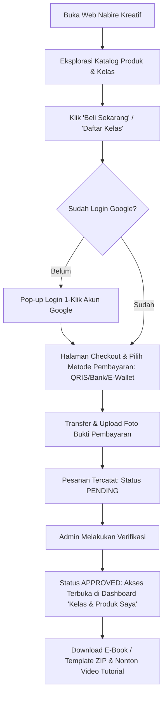
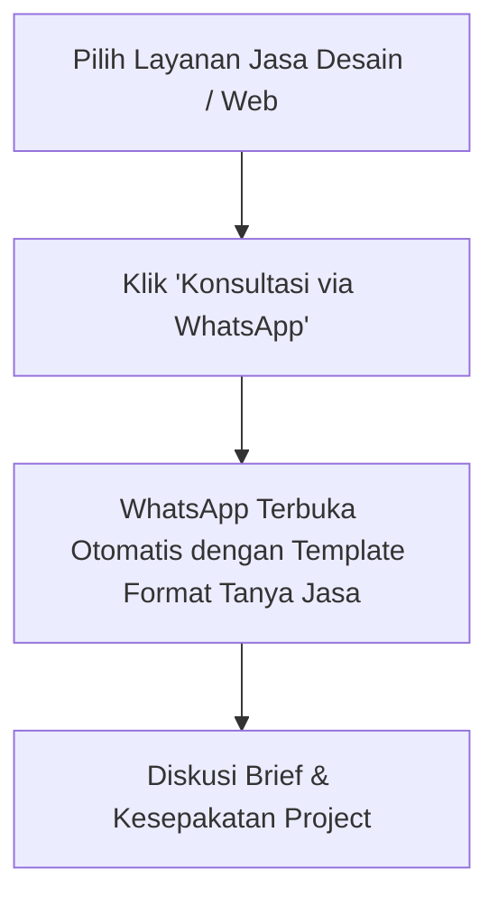

# 🌟 NABIRE KREATIF — Product Requirements Document (PRD) & Wireframe

---

## 1. 📌 Ringkasan Eksekutif & Visi Proyek

- **Nama Aplikasi**: **Nabire Kreatif** (*Platform Edukasi & Produk Digital Papua*)
- **Tagline**: *Kreativitas & Keterampilan Digital untuk Anak Muda & UMKM Nabire Menuju Indonesia Emas.*
- **Tujuan**: Menyediakan wadah terpercaya untuk membeli e-book praktis, template website siap pakai lengkap dengan video panduan, jasa pengerjaan skill desain & web, serta kelas pelatihan online.
- **Target Pengguna**: 
  1. Pelajar, Mahasiswa & Pemuda di Nabire & sekitarnya.
  2. Pelaku UMKM lokal yang butuh digitalisasi bisnis & template website.
  3. Kreator konten, desainer, dan masyarakat umum seluruh Indonesia.

---

## 2. 🏗️ Arsitektur Teknis & Komponen Sistem

```
┌─────────────────────────────────────────────────────────────────────────┐
│                      FRONTEND (SPA / JAMSTACK)                          │
│  - Vanilla HTML5 + Modern CSS Design Tokens (Dark Glassmorphism)        │
│  - Modern Vanilla JS (ES6+) with Zero-Dependencies                     │
│  - Google Identity Services (GIS) One-Tap / Button Login (Gmail)        │
│  - WhatsApp Floating Consultation Widget                                │
└────────────────────────────────────┬────────────────────────────────────┘
                                     │ HTTPS / JSON API
                                     ▼
┌─────────────────────────────────────────────────────────────────────────┐
│                 BACKEND REST API (Google Apps Script)                   │
│  - Single Dispatcher Architecture (`doGet` & `doPost`)                  │
│  - `LockService` Concurrency Protection                                 │
│  - JWT Verification & Role-Based Access Control (Admin / Member)        │
│  - Image / Proof Upload Processor to Google Drive                       │
└────────────────────────────────────┬────────────────────────────────────┘
                                     │ Spreadsheet API / DriveApp
                                     ▼
┌─────────────────────────────────────────────────────────────────────────┐
│              DATABASE & STORAGE (Google Workspace Cloud)                │
│  - Google Sheets: `Products`, `Orders`, `Users`, `Categories`           │
│  - Google Drive: Bukti Transfer, Source Code ZIP, E-Book PDF            │
│  - Video Player: YouTube Unlisted / Embedded Drive Player               │
└─────────────────────────────────────────────────────────────────────────┘
```

---

## 3. 🗄️ Struktur Database (Google Sheets Schema)

### Sheet 1: `Products` (Katalog Produk & Kelas)
| Kolom | Tipe Data | Keterangan | Contoh |
|---|---|---|---|
| `id` | String | ID Unik Produk (UUID) | `PRD-001` |
| `title` | String | Judul Produk / Kelas | *Template Web Portofolio + Video Tutorial* |
| `category` | String | Kategori: `ebook`, `template`, `jasa`, `kelas` | `template` |
| `price` | Number | Harga Normal (Rp) | `150000` |
| `discount_price`| Number | Harga Promo/Diskon (Rp) | `99000` |
| `thumbnail` | String | URL Gambar Cover / Thumbnail | `https://...` |
| `description` | Text | Deskripsi Lengkap & Silabus | `Paket lengkap website modern...` |
| `access_url` | String | Link File Google Drive / Video Pembelajaran | `https://drive.google.com/...` |
| `is_active` | Boolean | Status tayang (TRUE/FALSE) | `TRUE` |

### Sheet 2: `Orders` (Transaksi & Pembelian)
| Kolom | Tipe Data | Keterangan | Contoh |
|---|---|---|---|
| `order_id` | String | ID Transaksi | `ORD-20261010-001` |
| `created_at` | DateTime | Waktu Pemesanan | `2026-10-10 14:30:00` |
| `user_email` | String | Email Gmail Pembeli | `budi@gmail.com` |
| `user_name` | String | Nama Lengkap Pembeli | `Budi Santoso` |
| `product_id` | String | ID Produk yang Dipesan | `PRD-001` |
| `amount` | Number | Total Bayar (Rp) | `99000` |
| `payment_method`| String | `QRIS`, `BCA`, `BRI`, `MANDIRI`, `BANK_PAPUA`, `DANA` | `QRIS` |
| `proof_url` | String | URL Bukti Transfer di Google Drive | `https://drive.google.com/...` |
| `status` | String | `PENDING`, `APPROVED`, `REJECTED` | `PENDING` |
| `approved_at` | DateTime | Waktu Admin Menyetujui | `2026-10-10 15:00:00` |

### Sheet 3: `Users` (Data Member & Admin)
| Kolom | Tipe Data | Keterangan | Contoh |
|---|---|---|---|
| `email` | String (PK) | Email Google Akun | `admin@nabirekreatif.com` |
| `name` | String | Nama Lengkap | `Ahmad Gibran` |
| `picture` | String | Avatar Foto Akun Google | `https://lh3.googleusercontent.com/...` |
| `role` | String | `ADMIN` atau `MEMBER` | `ADMIN` |
| `joined_at` | DateTime | Tanggal Pertama Login | `2026-10-10` |

---

## 4. 🧭 Alur Pengguna (User Flow)

### A. Alur Pembeli / Member:


### B. Alur Klien Jasa (Custom Request):


### C. Alur Admin:
```mermaid
graph TD
    A[Login dengan Email Admin] --> B[Buka Tab Panel Admin Khusus]
    B --> C[Lihat Notifikasi Pesanan Masuk]
    C --> D[Cek Foto Bukti Pembayaran]
    D --> E[Klik Tombol 'Setujui (Approve)' atau 'Tolak']
    E --> F[Status Terupdate Realtime & Akses Terbuka untuk Member]
```

---

## 5. 📐 Wireframe Antarmuka (ASCII Layout)

### 💻 Tampilan 1: Beranda & Katalog Utama (Desktop / Mobile)
```text
┌──────────────────────────────────────────────────────────────────────────────┐
│  ✨ NABIRE KREATIF      [Katalog]  [Jasa Desain]  [Kelas]   👤 [Login Google]│
├──────────────────────────────────────────────────────────────────────────────┤
│  🚀 HERO BANNER                                                              │
│  ┌────────────────────────────────────────────────────────────────────────┐  │
│  │  Tingkatkan Skill Digital & Bisnismu Bersama Nabire Kreatif            │  │
│  │  Akses E-Book, Template Web Siap Pakai & Kelas Praktis Bergaransi.    │  │
│  │  [ 🔥 Jelajahi Katalog ]   [ 💬 Tanya Jasa Desain (WhatsApp) ]          │  │
│  └────────────────────────────────────────────────────────────────────────┘  │
│                                                                              │
│  🏷️ FILTER KATEGORI:  [Semua]  [📚 E-Book]  [💻 Template Web]  [🎓 Kelas]    │
│                                                                              │
│  📦 GRID KATALOG PRODUK & KELAS                                              │
│  ┌────────────────────┐ ┌────────────────────┐ ┌────────────────────┐       │
│  │ [Cover E-Book]     │ │ [Preview Template] │ │ [Thumbnail Kelas]  │       │
│  │ Panduan Desain UI  │ │ Web Portofolio Pro │ │ Master Web GAS     │       │
│  │ Rp 49.000 (Disc)   │ │ Rp 99.000          │ │ Rp 199.000         │       │
│  │ [Lihat Detail/Beli]│ │ [Lihat Detail/Beli]│ │ [Lihat Detail/Beli]│       │
│  └────────────────────┘ └────────────────────┘ └────────────────────┘       │
│                                                                              │
│                                                   [🟢 💬 WhatsApp Widget]    │
└──────────────────────────────────────────────────────────────────────────────┘
```

### 📱 Tampilan 2: Dashboard Member "Kelas & Produk Saya"
```text
┌──────────────────────────────────────────────────────────────────────────────┐
│  ✨ NABIRE KREATIF      [Katalog]  [Produk Saya]  [Profil]   👤 [Budi Santoso]│
├──────────────────────────────────────────────────────────────────────────────┤
│  🎓 DASHBOARD AKSES KELAS & PRODUK SAYA                                      │
│                                                                              │
│  ┌────────────────────────────────────────────────────────────────────────┐  │
│  │ 💻 Template Web Portofolio + Video Tutorial               [✅ AKTIF]   │  │
│  │ Tanggal Beli: 10 Okt 2026 | ID: ORD-20261010-001                       │  │
│  │ [ 📥 Download Template ZIP ]   [ 🎬 Tonton Video Tutorial ]            │  │
│  └────────────────────────────────────────────────────────────────────────┘  │
│                                                                              │
│  ┌────────────────────────────────────────────────────────────────────────┐  │
│  │ 📚 E-Book Belajar Desain Grafis Pemula                    [⏳ MENUNGGU] │  │
│  │ Menunggu konfirmasi pembayaran oleh Admin...                           │  │
│  │ [ 🔍 Cek Status Bukti Transfer ]                                       │  │
│  └────────────────────────────────────────────────────────────────────────┘  │
└──────────────────────────────────────────────────────────────────────────────┘
```

### ⚙️ Tampilan 3: Panel Admin (Khusus Email Owner/Admin)
```text
┌──────────────────────────────────────────────────────────────────────────────┐
│  ⚡ ADMIN PANEL NABIRE KREATIF                                                │
│  📊 Ringkasan: [Total Omset: Rp 4.850.000]  [Pesanan Pending: 3]             │
├──────────────────────────────────────────────────────────────────────────────┤
│  📋 VERIFIKASI PESANAN MASUK                                                 │
│  ┌────────────────────────────────────────────────────────────────────────┐  │
│  │ #ORD-001 │ Budi (budi@gmail.com) │ Rp 99.000 │ [Lihat Bukti Transfer] │  │
│  │ Produk: Template Web Portofolio                                        │  │
│  │ Action: [ ✅ Setujui (Approve) ]   [ ❌ Tolak ]                        │  │
│  └────────────────────────────────────────────────────────────────────────┘  │
│                                                                              │
│  ➕ TAMBAH / EDIT PRODUK BARU                                                │
│  [Input Judul] [Pilih Kategori] [Harga] [Link Drive Akses] [+ Simpan Produk] │
└──────────────────────────────────────────────────────────────────────────────┘
```

---

## 6. 🎨 Desain Visual System (Token & Estetika)

- **Tema Utama**: **Vibrant Creative with Dark Glassmorphism**
- **Tipografi**: Google Font `Plus Jakarta Sans` / `Outfit`
- **Warna Aksen**:
  - Primary: Deep Purple & Electric Indigo (`#6366F1` & `#8B5CF6`)
  - Accent / Vibrant: Bright Neon Cyan (`#06B6D4`) & Energetic Amber (`#F59E0B`)
  - Background: Dark Nebula Slate (`#0B0F19` & `#111827`) dengan Card Blur (`backdrop-filter: blur(16px)`)
- **Micro-Interactions**: Hover 3D tilt, smooth button ripple, modal transition, dan copy-to-clipboard instant.
